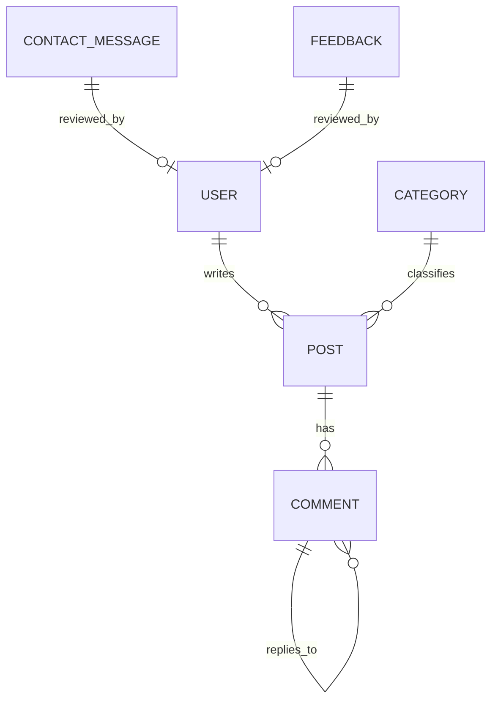

# Project Architecture: Certivo

This document provides a comprehensive overview of the software architecture, tech stack, data models, and functionalities of the Certivo project.

---

## 🚀 Tech Stack

### Backend
- **Framework:** [Flask](https://flask.palletsprojects.com/) (Python)
- **ORM:** [SQLAlchemy](https://www.sqlalchemy.org/) with [Flask-SQLAlchemy](https://flask-sqlalchemy.palletsprojects.com/)
- **Authentication:** [Flask-Login](https://flask-login.readthedocs.io/)
- **Forms:** [Flask-WTF](https://flask-wtf.readthedocs.io/) / [WTForms](https://wtforms.readthedocs.io/)
- **Migrations:** [Flask-Migrate](https://flask-migrate.readthedocs.io/) (Alembic)
- **Security:** [Werkzeug](https://werkzeug.palletsprojects.com/) (Hashing), [Bleach](https://bleach.readthedocs.io/) (HTML Sanitization)
- **Utilities:** `python-slugify`, `Pillow` (Image processing), `python-dotenv`, `libsass` (SCSS compilation)

### Frontend
- **Templating:** [Jinja2](https://jinja.palletsprojects.com/)
- **Styling:** SCSS (compiled to CSS via `libsass`), Vanilla CSS
- **Interactivity:** Vanilla JavaScript
- **Assets:** Google Fonts, Font Awesome Icons

### Database
- **Development:** SQLite (`database.db`)
- **Production (Compatible):** PostgreSQL, MySQL (via SQLAlchemy)

---

## 📊 Models & Database Tables

### 1. `users` Table
Stores administrative user accounts.
| Column | Type | Description |
| :--- | :--- | :--- |
| `id` | Integer | Primary Key |
| `username` | String(80) | Unique username (Indexed) |
| `email` | String(120) | Unique email (Indexed) |
| `password_hash` | String(255) | Hashed password |
| `is_admin` | Boolean | Administrative privileges |
| `avatar` | String(255) | Path to profile image |
| `bio` | Text | User biography |
| `is_active` | Boolean | Account status |
| `created_at` | DateTime | Account creation timestamp |

### 2. `posts` Table
Core blog post data.
| Column | Type | Description |
| :--- | :--- | :--- |
| `id` | Integer | Primary Key |
| `title` | String(200) | Post title |
| `slug` | String(220) | Unique URL slug (Indexed) |
| `author_id` | Integer | Foreign Key -> `users.id` |
| `category_id` | Integer | Foreign Key -> `categories.id` |
| `content` | Text | Main post content (HTML) |
| `excerpt` | Text | Brief summary |
| `featured_image` | String(255) | Header image path |
| `is_published` | Boolean | Visibility status |
| `is_featured` | Boolean | Hero section status |
| `views` | Integer | View counter |
| `published_at` | DateTime | Publication timestamp |

### 3. `categories` Table
Grouping for blog posts.
| Column | Type | Description |
| :--- | :--- | :--- |
| `id` | Integer | Primary Key |
| `name` | String(80) | Category name |
| `slug` | String(80) | Unique URL slug |
| `color` | String(7) | Hex color for UI badges |
| `icon` | String(50) | FontAwesome icon class |

### 4. `comments` Table
User-submitted comments on posts.
| Column | Type | Description |
| :--- | :--- | :--- |
| `id` | Integer | Primary Key |
| `post_id` | Integer | Foreign Key -> `posts.id` |
| `parent_id` | Integer | Foreign Key -> `comments.id` (for replies) |
| `name` | String(100) | Commenter name |
| `email` | String(120) | Commenter email |
| `content` | Text | Comment body |
| `is_approved` | Boolean | Moderation status |

### 5. `contact_messages` Table
Messages from the site contact form.
| Column | Type | Description |
| :--- | :--- | :--- |
| `id` | Integer | Primary Key |
| `name` | String(100) | Sender name |
| `email` | String(120) | Sender email |
| `subject` | String(200) | Message subject |
| `message` | Text | Message content |
| `is_read` | Boolean | Admin read status |

### 6. `feedback` Table
Site user feedback with ratings.
| Column | Type | Description |
| :--- | :--- | :--- |
| `id` | Integer | Primary Key |
| `rating` | Integer | Star rating (1-5) |
| `message` | Text | Feedback content |

### 7. `affiliate_links` Table
Monetization link management.
| Column | Type | Description |
| :--- | :--- | :--- |
| `id` | Integer | Primary Key |
| `title` | String(200) | Product/Service title |
| `url` | String(500) | Affiliate URL |
| `clicks` | Integer | Click-through counter |
| `is_active` | Boolean | Visibility status |

---

## 📐 ER Diagram

---

## ⚙️ Environment Variables (.env)

| Key | Description | Default/Example |
| :--- | :--- | :--- |
| `FLASK_ENV` | Environment mode | `development` |
| `SECRET_KEY` | Security salt for sessions | `(random string)` |
| `DATABASE_URL` | SQLAlchemy connection URI | `sqlite:///database.db` |
| `MAIL_SERVER` | SMTP server for notifications | `smtp.gmail.com` |
| `MAIL_USERNAME` | Email account for sending | `user@example.com` |
| `SITE_NAME` | Website display name | `Certivo` |
| `SITE_URL` | Base URL for SEO/Sitemap | `http://localhost:5000` |
| `ADSENSE_ENABLED`| Toggle Google AdSense | `false` |

---

## ✨ Main Functionalities

### 👤 User & Auth
- Secure Admin Login/Logout.
- Role-based access (Admin only for dashboard).
- Profile management with avatars.

### 📝 Blog Management
- **Full CRUD:** Create, Read, Update, Delete posts.
- **Publishing Workflow:** Drafts vs. Published posts with timestamps.
- **Rich Text Editing:** Support for HTML content and media embedding.
- **Featured Posts:** Highlight specific content on the homepage hero.
- **Auto-Excerpt:** Automatic generation of summaries if not provided.

### 📁 Category Management
- Categorize posts with custom colors and icons.
- Post filtering by category on the frontend.

### 💬 Engagement & Moderation
- **Nested Comments:** Support for user replies.
- **Moderation Queue:** Approve, Delete, or Mark comments as Spam.
- **Contact Form:** Database persistence and email notifications for admins.
- **Feedback System:** User ratings (1-5 stars) and testimonials.

### 💰 Monetization
- **Affiliate Links:** Centralized management of referral links.
- **Click Tracking:** Monitor performance of affiliate offers.
- **AdSense Integration:** Global toggle and Slot management.

### 🔍 SEO & Optimization
- **Sitemap.xml:** Dynamically generated XML sitemap.
- **Robots.txt:** Search engine instructions.
- **Meta Tags:** Customizable Title, Description, and Keywords per post.
- **Slugs:** Clean, SEO-friendly URLs.

### 📁 Media Management
- **Image Uploads:** Managed storage for post headers and inline content.
- **Media Gallery:** Browser for existing uploads in the admin panel.
